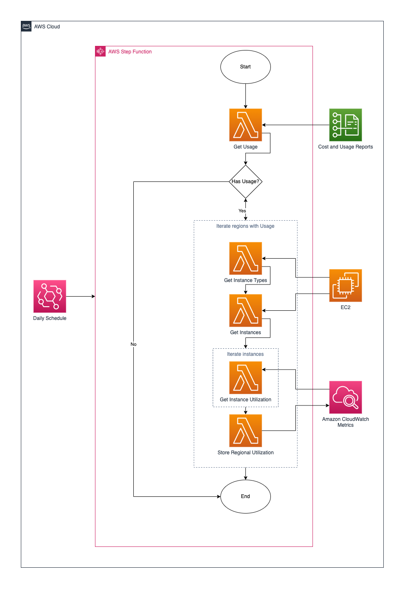

## Resource Utilization

This is just the first and most simple version of an account wide resource utilization metric & dashboard, to get overall 
insights on actually how much room for optimization is available.

As a baseline, initial version considers only Amazon EC2 service CPU Utilization.

## Requirements
* Setup AWS credentials for your environment: [instructions here](https://docs.aws.amazon.com/cli/latest/userguide/cli-configure-files.html)
* Install AWS SAM CLI: [instructions here](https://docs.aws.amazon.com/serverless-application-model/latest/developerguide/install-sam-cli.html)

## Architecture

## Deployment

Inside your terminal, execute `deploy.sh` to pack and deploy the `template.yaml` AWS CloudFormation template:

`./deploy.sh`

## Usage

This template includes an AWS Step Function that orchestrates the whole metric gathering and aggregation process.
It is triggered daily via an Amazon EventBridge rule, so that no manual intervention is needed to process the data.

Statistical data is stored per region as Amazon CloudWatch metrics and displayed in an Amazon CloudWatch Dashboard 
available for your analysis.

## Security

See [CONTRIBUTING](CONTRIBUTING.md#security-issue-notifications) document for more information.

## License

This library is licensed under the MIT-0 License. See [LICENSE](LICENSE) file.

